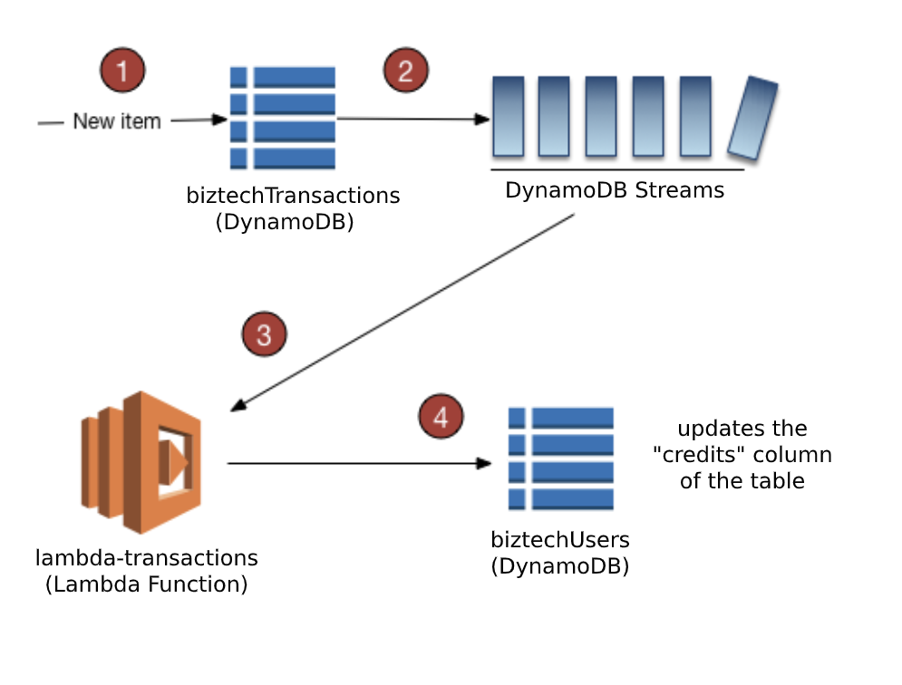

# Lambda Transactions
Lambda to keep all Biztech Users Credits up-to-date based on the transaction tables.

This lambda is used to automatically update the `biztechUsers`/`biztechUsersPROD` table when new rows are **inserted** into the `biztechTransactions`/`biztechTransactionsPROD` table. (As of now, updates to the transaction tables are completely ignored).

The diagram below draws a better picture of where the lambda plays a part.



### Installation

1. Clone the repo:

    ```
    $ git clone https://github.com/ubc-biztech/lambda-transactions
    ```

2. Install the packages:

    ```
    $ cd lambda-transactions
    ```

    and

    ```
    $ npm install
    ```

### Scripts

`$ npm test` - Runs local tests using Jest

`$ npm run build` - Builds the lambda into a `.zip` file (lambda-transactions.zip)

`$ npm run deploy [ENV]` - Builds and deploys the lambda to the cloud. Use `[ENV]` to specify the environment you want to deploy to (accepts `stage` or `prod`)


### Environmental Files

A few dotenv (`.env`) environmental files are provided at `root`

They correspond to the environmental variables that need to be provided for each lambda


### Testing

Test the lambda's logic by running the following script:
```
npm run test
```

The script makes use of Jest to run all the tests located in the `./tests` folder. 

### Deployment

To update new versions of the lambda function, run the following:
```
npm run deploy [ENV]
```
to build the lambda function and push it to the AWS cloud. Make sure that you have the appropriate AWS credentials. In order to do this, you need to obtain the **AWS ACCESS KEY & SECRET**, place them in the AWS `config` and `credential` files (located in `~/.aws`),

### Built With

* [Node](https://nodejs.org/) - Javascript Runtime Environment
* [AWS SDK](https://aws.amazon.com/sdk-for-browser/) - Software Development Kit for using AWS Services
* [Jest](https://jestjs.io/) - Javascript Testing Framework
